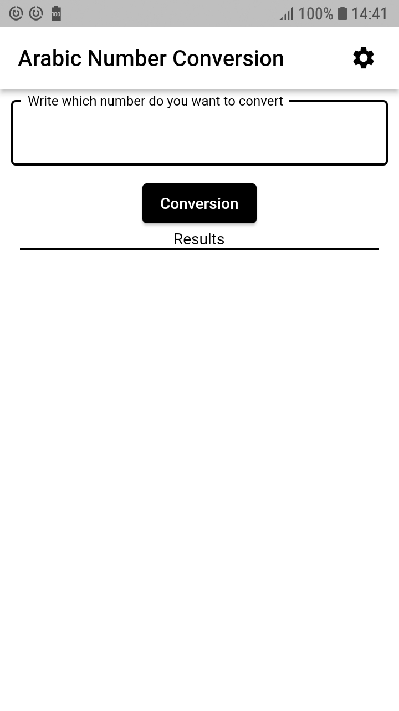
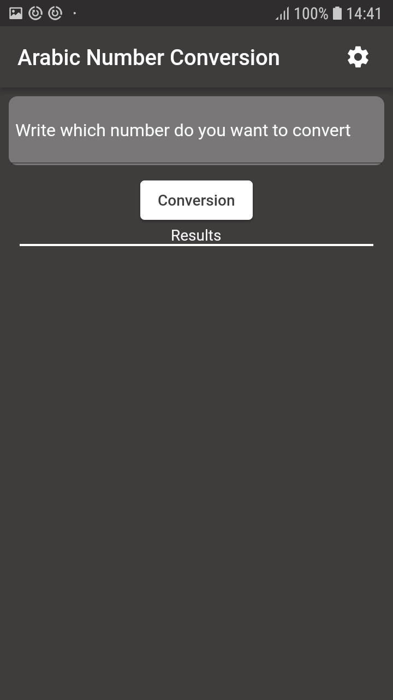

# arabic_number_conversion

Flutter application where I use Provider for state management that converts the entered number to its English phrase and I do the filing with mvvm.

## Getting Started

You can enter the number you want converted to English phrase in the Text Field at the top. 
And press the Convert button to convert

  

If you want to change the light theme to dark theme. Tap the settings button in the top right. Then you can change the theme. 
You can add colors by changing the colors from the lib/core/constants file optionally.

  
  
  

